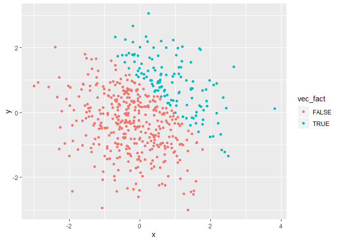

P8105\_hw1\_yx2507
================

## Yuqing Xue 9/18/2019

# Problem 1

## Making data frame with different variable types

First, create a data frame comprised of: *a random sample of size 8 from
a standard Normal distribution; *a logical vector indicating whether
elements of the sample are greater than 0; \*a character vector of
length 8; a factor vector of length 8, with 3 different factor “levels”.
Below shows the code and the result:

``` r
 problem_1 = tibble(
   vec_numeric=rnorm(8),
   vec_logical=vec_numeric>0,
   vec_char=c("a","b","c","d","e","f","g","h"),
   vec_factor = factor(c("M","F","M","F","M","F","M","F"))

 ) 
#CHECK DATA FRAME
problem_1
```

    ## # A tibble: 8 x 4
    ##   vec_numeric vec_logical vec_char vec_factor
    ##         <dbl> <lgl>       <chr>    <fct>     
    ## 1      -0.684 FALSE       a        M         
    ## 2      -0.875 FALSE       b        F         
    ## 3      -0.315 FALSE       c        M         
    ## 4       0.733 TRUE        d        F         
    ## 5       1.02  TRUE        e        M         
    ## 6       1.63  TRUE        f        F         
    ## 7       0.622 TRUE        g        M         
    ## 8       1.51  TRUE        h        F

Data frame called problem\_1 is created, containing four vairables:
numeric varaiable“vec\_numeric”, logical variable“vec\_logical”,
character variable“vec\_char” and factor varaible called“vec\_factor”.

## Mean calculation

Try to take the mean of each varrable in the dataset problem\_1. The
`mean()`function works for numeric vairable `vec_numeric` and also works
for logical variable`vec_logical`because it will convert `True`to 1 and
`False` to 0. Code and results are shown below:

``` r
mean(problem_1$vec_numeric)
```

    ## [1] 0.4554921

``` r
mean(problem_1$vec_logical)
```

    ## [1] 0.625

When trying to calculate the mean for character variable “vec\_char” and
factor variable“vec\_factor”, warning shows up with N/A result. Mean
function doesn’t support these two variable types. Code and results are
shown
    below:

``` r
mean(problem_1$vec_char)
```

    ## Warning in mean.default(problem_1$vec_char): argument is not numeric or
    ## logical: returning NA

    ## [1] NA

``` r
mean(problem_1$vec_fator)
```

    ## Warning: Unknown or uninitialised column: 'vec_fator'.

    ## Warning in mean.default(problem_1$vec_fator): argument is not numeric or
    ## logical: returning NA

    ## [1] NA

## Conercion

Use `as.numeric`to convert character, logical and factor variables into
numeric varaibles, use `evel=false`to hide the result and show the code
chunk.

Coercision can change charactor vairable into N/A but can’t convert to
numeric variable. So it can’t be calculated mean. While for logical
variable, when converting to numerica vairables, “True” and “False” can
be covert to 1 and 0 respectively. For factor variable, they can convert
to the number indicating its level.

## Multiply by random sample

In the below steps: \* convert the logical vector to numeric, and
multiply the random sample by the result \* convert the logical vector
to a factor, and multiply the random sample by the result \* convert the
logical vector to a factor and then convert the result to numeric, and
multiply the random sample by the result Code and results are shown
below: When change type to numeric varaible, we can get the product
after it multiply by a random
    sample:

``` r
as.numeric(problem_1$vec_logical)*rnorm(8)
```

    ## [1]  0.0000000  0.0000000  0.0000000  1.4221480  0.0290778  0.1434835
    ## [7]  0.3629646 -0.6363881

It’s now meaningful to multiply a factor vairable which is converted
from a logical variable to and random sample. N/A and warning sign shows
up in the
    result.

``` r
as.factor(problem_1$vec_logical)*rnorm(8)
```

    ## Warning in Ops.factor(as.factor(problem_1$vec_logical), rnorm(8)): '*' not
    ## meaningful for factors

    ## [1] NA NA NA NA NA NA NA NA

But, after conver to a factor variable, it works after convert the
factor varaible to a numeric vairable and then multiply a random
    sample.

``` r
as.numeric(as.factor(problem_1$vec_logical))*rnorm(8)
```

    ## [1]  0.3273890 -1.1501317 -0.1846267 -0.3036368  2.3311531 -1.3277868
    ## [7]  1.2824104 -2.2136833

# Problem 2 Including Plots

## Create data frame

Create a data frame comprised of: x: a random sample of size 500 from a
standard Normal distribution y: a random sample of size 500 from a
standard Normal distribution A logical vector indicating whether x + y
\> 1 A numeric vector created by coercing the above logical vector A
factor vector created by coercing the above logical vector

``` r
set.seed(2)
  x=rnorm(500)
  y=rnorm(500)
  vec_logical_plot= x + y > 1
  vec_num = as.numeric(vec_logical_plot)
  vec_fact = as.factor(vec_logical_plot)
  
plot_df=tibble(x,y,vec_logical_plot,vec_fact,vec_num)

head(plot_df)
```

    ## # A tibble: 6 x 5
    ##         x      y vec_logical_plot vec_fact vec_num
    ##     <dbl>  <dbl> <lgl>            <fct>      <dbl>
    ## 1 -0.897  -0.460 FALSE            FALSE          0
    ## 2  0.185   0.618 FALSE            FALSE          0
    ## 3  1.59   -0.720 FALSE            FALSE          0
    ## 4 -1.13   -0.584 FALSE            FALSE          0
    ## 5 -0.0803  0.216 FALSE            FALSE          0
    ## 6  0.132   1.24  TRUE             TRUE           1

The number of rows in `plot_df` is 500 columns is 5. The mean of x in
the dataframe is 0.0616923. The median of the sample is 0.0439172.The
standard deviation of the sample is1.0323776 The proportion of x+y\>1 is
0.266

## Create scatterplot

Make a scatterplot of `y` and `x`, and color points using logical
variable`vec_logical_plot`,factor variable `vec_fact` and numeric
variable`vec_num` separately.

1.  color the logical
vairable

<!-- end list -->

``` r
ggplot(plot_df, aes(x = x, y = y, color=vec_logical_plot)) + geom_point()
```

<!-- -->

2.  color the factor variable

<!-- end list -->

``` r
ggplot(plot_df, aes(x = x, y = y, color=vec_fact)) + geom_point()
```

<!-- -->

3.  colort the numeric varaible

<!-- end list -->

``` r
ggplot(plot_df, aes(x = x, y = y, color=vec_num)) + geom_point()
```

<!-- -->

When the points are colored using nemeric variable, the color scale is
shown as a continuous ranging from 0 to 1. If the points are colored by
factor and logical varaible, the color scale will just show “false” and
“true” regarding of the of color it used.

## Export the this scatterplot

Using `ggsave` to export the scatterplot to a pdf document
named“scatter\_plot.pdf”.

``` r
ggsave("scatter_plot.pdf",height=4,width=6)
```
