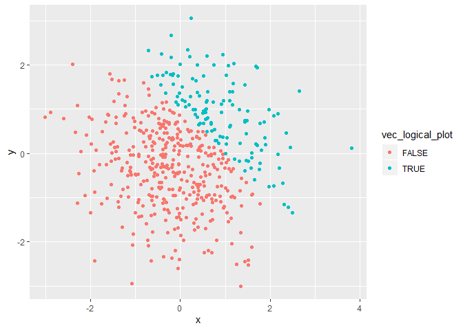

p8105\_hw1\_yx2507
================

``` r
library(tidyverse)
```

    ## -- Attaching packages ------------------------------------------------------------------------------------------ tidyverse 1.2.1 --

    ## v ggplot2 3.2.1     v purrr   0.3.2
    ## v tibble  2.1.3     v dplyr   0.8.3
    ## v tidyr   0.8.3     v stringr 1.4.0
    ## v readr   1.3.1     v forcats 0.4.0

    ## -- Conflicts --------------------------------------------------------------------------------------------- tidyverse_conflicts() --
    ## x dplyr::filter() masks stats::filter()
    ## x dplyr::lag()    masks stats::lag()

# problem 1

## making data frame

Create a data frame comprised of: a random sample of size 8 from a
standard Normal distribution; a logical vector indicating whether
elements of the sample are greater than 0; a character vector of length
8; a factor vector of length 8, with 3 different factor “levels”. Below
shows the code and the result:

``` r
 problem_1=tibble(
   vec_numeric=rnorm(8),
   vec_logical=vec_numeric>0,
   vec_char=c("a","b","c","d","e","f","g","h"),
   vec_factor = factor(c("M","F","M","F","M","F","M","F"))

 ) 
#CHECK DATA FRAME
problem_1
```

    ## # A tibble: 8 x 4
    ##   vec_numeric vec_logical vec_char vec_factor
    ##         <dbl> <lgl>       <chr>    <fct>     
    ## 1       1.41  TRUE        a        M         
    ## 2       1.00  TRUE        b        F         
    ## 3       0.575 TRUE        c        M         
    ## 4       0.910 TRUE        d        F         
    ## 5       1.46  TRUE        e        M         
    ## 6      -0.295 FALSE       f        F         
    ## 7      -0.391 FALSE       g        M         
    ## 8      -0.383 FALSE       h        F

## now take the mean

The result shows that numeric vairable and logical variable work while
factor and character vairable can’t get the
    mean.

``` r
mean(problem_1$vec_numeric)
```

    ## [1] 0.5363142

``` r
mean(problem_1$vec_logical)
```

    ## [1] 0.625

``` r
mean(problem_1$vec_char)
```

    ## Warning in mean.default(problem_1$vec_char): argument is not numeric or
    ## logical: returning NA

    ## [1] NA

``` r
mean(problem_1$vec_fator)
```

    ## Warning: Unknown or uninitialised column: 'vec_fator'.

    ## Warning in mean.default(problem_1$vec_fator): argument is not numeric or
    ## logical: returning NA

    ## [1] NA

## Conercion

Tn the below steps: \* convert the logical vector to numeric, and
multiply the random sample by the result \* convert the logical vector
to a factor, and multiply the random sample by the result \* convert the
logical vector to a factor and then convert the result to numeric, and
multiply the random sample by the result

``` r
as.numeric(problem_1$vec_char)
```

    ## Warning: NAs introduced by coercion

    ## [1] NA NA NA NA NA NA NA NA

``` r
as.numeric(problem_1$vec_logical)
```

    ## [1] 1 1 1 1 1 0 0 0

``` r
as.numeric(problem_1$vec_factor)
```

    ## [1] 2 1 2 1 2 1 2 1

coercision can change charactor vairable into N/A but can’t convert to
numeric variable. So it can’t be calculated mean. While for logical
variable, when converting to numerica vairables, “True” and “False” can
be covert to 1 and 0 respectively. For factor variable, they can convert
to the number indicating its
    level.

## multiply by random sample

``` r
as.numeric(problem_1$vec_logical)*rnorm(8)
```

    ## [1] -0.3491098  0.5299306 -1.7259651 -1.0495287  0.1557664  0.0000000
    ## [7]  0.0000000  0.0000000

``` r
as.factor(problem_1$vec_logical)*rnorm(8)
```

    ## Warning in Ops.factor(as.factor(problem_1$vec_logical), rnorm(8)): '*' not
    ## meaningful for factors

    ## [1] NA NA NA NA NA NA NA NA

``` r
as.numeric(as.factor(problem_1$vec_logical))*rnorm(8)
```

    ## [1] -0.01740582 -4.04557740  1.32813888  0.52509994 -3.09528762 -0.01666257
    ## [7]  1.38253642 -1.08578146

# Problem 2 Including Plots

## Create data frame

Create a data frame comprised of: x: a random sample of size 500 from a
standard Normal distribution y: a random sample of size 500 from a
standard Normal distribution A logical vector indicating whether x + y
\> 1 A numeric vector created by coercing the above logical vector A
factor vector created by coercing the above logical vector

``` r
set.seed(2)
  x=rnorm(500)
  y=rnorm(500)
  vec_logical_plot= x + y > 1
  vec_num = as.numeric(vec_logical_plot)
  vec_fact = as.factor(vec_logical_plot)
  
plot_df=tibble(x,y,vec_logical_plot,vec_fact,vec_num)

head(plot_df)
```

    ## # A tibble: 6 x 5
    ##         x      y vec_logical_plot vec_fact vec_num
    ##     <dbl>  <dbl> <lgl>            <fct>      <dbl>
    ## 1 -0.897  -0.460 FALSE            FALSE          0
    ## 2  0.185   0.618 FALSE            FALSE          0
    ## 3  1.59   -0.720 FALSE            FALSE          0
    ## 4 -1.13   -0.584 FALSE            FALSE          0
    ## 5 -0.0803  0.216 FALSE            FALSE          0
    ## 6  0.132   1.24  TRUE             TRUE           1

the number of rows in `plot_df` is 500 columns is 5. The mean of x in
the dataframe is 0.0616923. The median of the sample is 0.0439172.The
standard deviation of the sample is1.0323776 The proportion of x+y\>1 is
NaN, NaN, NaN, NaN, NaN, 1, NaN, NaN, NaN, 1, NaN, 1, NaN, 1, 1, NaN, 1,
NaN, 1, 1, 1, NaN, 1, 1, NaN, NaN, 1, NaN, 1, NaN, NaN, NaN, 1, NaN,
NaN, NaN, NaN, NaN, NaN, NaN, NaN, NaN, NaN, 1, NaN, 1, NaN, NaN, NaN,
NaN, NaN, 1, NaN, 1, NaN, NaN, NaN, 1, 1, 1, NaN, 1, NaN, NaN, NaN, NaN,
NaN, NaN, 1, NaN, NaN, 1, NaN, NaN, 1, NaN, 1, NaN, 1, NaN, NaN, NaN,
NaN, NaN, NaN, 1, NaN, NaN, NaN, 1, NaN, 1, NaN, NaN, NaN, NaN, 1, NaN,
NaN, NaN, NaN, NaN, NaN, NaN, NaN, 1, 1, 1, NaN, NaN, NaN, NaN, NaN, 1,
NaN, NaN, 1, NaN, NaN, NaN, NaN, NaN, 1, NaN, NaN, NaN, NaN, NaN, NaN,
NaN, NaN, 1, NaN, NaN, 1, NaN, 1, NaN, 1, NaN, NaN, NaN, NaN, NaN, NaN,
NaN, NaN, NaN, NaN, NaN, 1, 1, 1, NaN, 1, NaN, NaN, NaN, NaN, NaN, NaN,
1, 1, NaN, NaN, NaN, 1, NaN, NaN, 1, NaN, 1, NaN, 1, NaN, NaN, NaN, NaN,
NaN, NaN, NaN, NaN, NaN, NaN, NaN, 1, NaN, NaN, NaN, NaN, NaN, NaN, NaN,
NaN, 1, NaN, NaN, NaN, NaN, NaN, 1, NaN, 1, 1, NaN, 1, NaN, NaN, NaN,
NaN, NaN, NaN, 1, NaN, NaN, 1, 1, NaN, NaN, 1, NaN, 1, NaN, NaN, NaN, 1,
NaN, 1, NaN, 1, 1, NaN, NaN, NaN, NaN, NaN, NaN, NaN, 1, NaN, NaN, 1, 1,
1, NaN, NaN, NaN, 1, NaN, NaN, NaN, NaN, NaN, NaN, NaN, NaN, NaN, NaN,
NaN, NaN, 1, NaN, NaN, NaN, 1, NaN, 1, NaN, NaN, NaN, NaN, NaN, NaN,
NaN, NaN, 1, NaN, 1, NaN, NaN, 1, NaN, 1, NaN, 1, 1, 1, NaN, 1, NaN,
NaN, NaN, NaN, NaN, 1, NaN, NaN, NaN, NaN, 1, NaN, NaN, 1, NaN, NaN,
NaN, 1, 1, 1, NaN, NaN, NaN, NaN, NaN, NaN, NaN, NaN, NaN, NaN, NaN,
NaN, 1, 1, NaN, NaN, NaN, 1, NaN, 1, 1, 1, 1, NaN, 1, 1, NaN, 1, NaN, 1,
NaN, 1, 1, NaN, NaN, 1, NaN, NaN, NaN, NaN, NaN, NaN, NaN, NaN, NaN, 1,
NaN, 1, NaN, NaN, NaN, 1, 1, NaN, 1, NaN, NaN, NaN, NaN, NaN, NaN, NaN,
1, NaN, 1, NaN, NaN, NaN, 1, NaN, 1, NaN, NaN, NaN, NaN, NaN, NaN, NaN,
NaN, 1, NaN, NaN, 1, NaN, NaN, NaN, NaN, NaN, 1, NaN, NaN, NaN, NaN,
NaN, NaN, NaN, NaN, NaN, NaN, NaN, NaN, 1, NaN, 1, NaN, NaN, 1, NaN,
NaN, 1, NaN, 1, NaN, 1, NaN, 1, NaN, NaN, 1, NaN, NaN, NaN, NaN, NaN,
NaN, 1, NaN, NaN, 1, NaN, NaN, NaN, NaN, NaN, NaN, 1, NaN, NaN, 1, NaN,
NaN, NaN, NaN, NaN, NaN, 1, NaN, NaN, 1, NaN, NaN, NaN, NaN, NaN, NaN,
NaN, NaN, NaN, NaN, 1, NaN, 1, 1, NaN, NaN, NaN, NaN, NaN, NaN, NaN,
NaN, NaN, NaN, NaN, NaN, NaN, NaN, NaN, NaN, NaN, NaN, NaN, NaN, 1, 1,
NaN, NaN, NaN, NaN, NaN, NaN

## create scatterplot

color the logical
vairable

``` r
ggplot(plot_df, aes(x = x, y = y, color=vec_logical_plot)) + geom_point()
```

<!-- -->
color the factor variable

``` r
ggplot(plot_df, aes(x = x, y = y, color=vec_fact)) + geom_point()
```

<!-- -->
colort the numeric varaible

``` r
ggplot(plot_df, aes(x = x, y = y, color=vec_num)) + geom_point()
```

<!-- -->

## export the this scatterplot

``` r
ggsave("scatter_plot.pdf",height=4,width=6)
```
